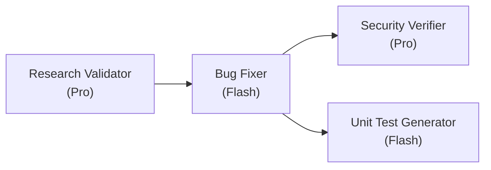

# 🤖 Homework 4 — 4-Agent Bug-Fix Pipeline

> **Student Name**: Dmytro Samartsov
> **Date Submitted**: 2026-06-22
> **AI Tools Used**: Google Antigravity CLI (agy)

A single-command, **4-agent pipeline** that researches,
fixes, security-reviews, and test-covers seeded defects in a small **.NET 10 minimal-API
internal wiki**. Every stage is a real headless `agy -p` run with an explicit,
task-appropriate model.

---

## The pipeline



**Run order:** Research Validator → Bug Fixer → Security Verifier (on changed code) → Unit Test Generator (on changed code).

Run it all with one command:

```bash
cd homework-4
./run-pipeline.sh
```

The four agents are the Research Verifier, Bug Fixer, Security Verifier, and
Unit Test Generator (Tasks 1–4). The pipeline is fully automated and runs using only the `bug-context.md` as its initial input!

---

## Agents and model selection

Each agent is structured as an Antigravity Skill within an `agents/<skill-name>/SKILL.md` file 
with YAML frontmatter (`name`, `description`, `model`). The orchestrator **parses the model 
from the frontmatter** and passes the skill instructions dynamically via prompt interpolation.

| Agent | Model | Why this model |
|-------|-------|----------------|
| `research-validator` | **Gemini 3.1 Pro (High)** | Fact-checking every `file:line` and snippet is precision-critical; the strongest reasoning model is justified. |
| `bug-fixer` | **Gemini 3.5 Flash (Medium)** | Mechanical, well-specified application of a plan with reliable tool use. |
| `security-verifier` | **Gemini 3.1 Pro (High)** | Highest-stakes judgement — severity calibration and security reasoning on changed code. |
| `unit-test-generator` | **Gemini 3.5 Flash (Medium)** | Fast, routine xUnit scaffolding against a small, well-specified surface. |

**Model IDs used:** `Gemini 3.1 Pro (High)`, `Gemini 3.5 Flash (Medium)`.

---

## Skills

Two skills are loaded **automatically** — the orchestrator appends the skill file to the
relevant agent's system prompt at run time, so there is no manual step:

- **`skills/research-quality-measurement.md`** (Task 1.2) — a rubric of research-quality
  levels (Verified / Mostly Verified / Partially Verified / Unverified) that the Research
  Verifier applies when writing `verified-research.md`.
- **`skills/unit-tests-FIRST.md`** (Task 4.2) — the **FIRST** principles (Fast,
  Independent, Repeatable, Self-validating, Timely) the Unit Test Generator follows.

---

## The sample application (`src/WikiApi`)

A .NET 10 minimal API for an internal wiki, backed by a thread-safe in-memory store
seeded with three pages (*Onboarding Guide*, *VPN Setup*, *Expense Policy*).

| Method | Route | Purpose |
|--------|-------|---------|
| GET | `/documents` | list all |
| GET | `/documents/search?q=` | search title/content/tags |
| GET | `/documents/{id}` | fetch one |
| POST | `/documents` | create |
| PUT | `/documents/{id}` | update |
| DELETE | `/documents/{id}` | delete (requires `X-Admin-Token` header) |

Business logic lives in plain classes (`Services/DocumentStore.cs`,
`Auth/AdminTokenValidator.cs`) so it is fast to unit-test and is exactly the "changed
code" the verifiers inspect. `Program.cs` handlers are thin.

### Seeded defects (the pipeline's work — see `context/bugs/001/bug-context.md`)

- **Bug #1 — case-sensitive search.** `Search` uses ordinal `Contains`, so `?q=vpn` never
  finds *VPN Setup*. → fix: `StringComparison.OrdinalIgnoreCase` across title/content/tags.
- **Bug #2 — update corrupts timestamps.** `Update` overwrites `CreatedAt` with "now" and
  never advances `UpdatedAt`. → fix: preserve `CreatedAt`, set `UpdatedAt = now`.
- **SEC-1 — hardcoded secret + timing-unsafe compare** in `AdminTokenValidator`. → fix:
  read `WIKI_ADMIN_TOKEN` from config; compare with `CryptographicOperations.FixedTimeEquals`.
- **SEC-2 — missing input validation** on create/update. → fix: reject empty `Title`, cap
  lengths, return `400`.

**Security review vs. "resolved after":** Task 3 makes the Security Verifier **report
only**. So the security remediation is scoped into the Planner → Fixer stages (the auth
file becomes *changed code*), and the Security Verifier then **confirms** SEC-1/SEC-2 are
resolved on the changed file and scans for residual issues — it verifies, never edits.

---

## Agent outputs (`context/bugs/001/`)

Produced by a real pipeline run and committed as evidence:

| File | Author agent |
|------|--------------|
| `research/codebase-research.md` | (Provided manually) |
| `research/verified-research.md` | Research Validator (uses quality skill) |
| `implementation-plan.md` | (Provided manually) |
| `fix-summary.md` | Bug Fixer |
| `security-report.md` | Security Verifier |
| `test-report.md` | Unit Test Generator (uses FIRST skill) |

---

## Project structure

```
homework-4/
├── README.md / HOWTORUN.md / run-pipeline.sh / WikiApi.sln / .gitignore
├── agents/         # 4 skill directories containing SKILL.md files
├── skills/         # research-quality-measurement.md, unit-tests-FIRST.md
├── src/WikiApi/    # the .NET 10 minimal-API wiki (Models / Services / Auth / Program)
├── tests/WikiApi.Tests/   # xUnit (scaffold + generated tests)
├── context/bugs/001/      # bug-context.md (seed) + agent outputs
└── docs/screenshots/      # pipeline run, fixes, security scan, tests
```

See **[HOWTORUN.md](./HOWTORUN.md)** to run the app, the tests, and the pipeline.
